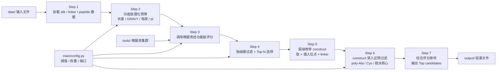
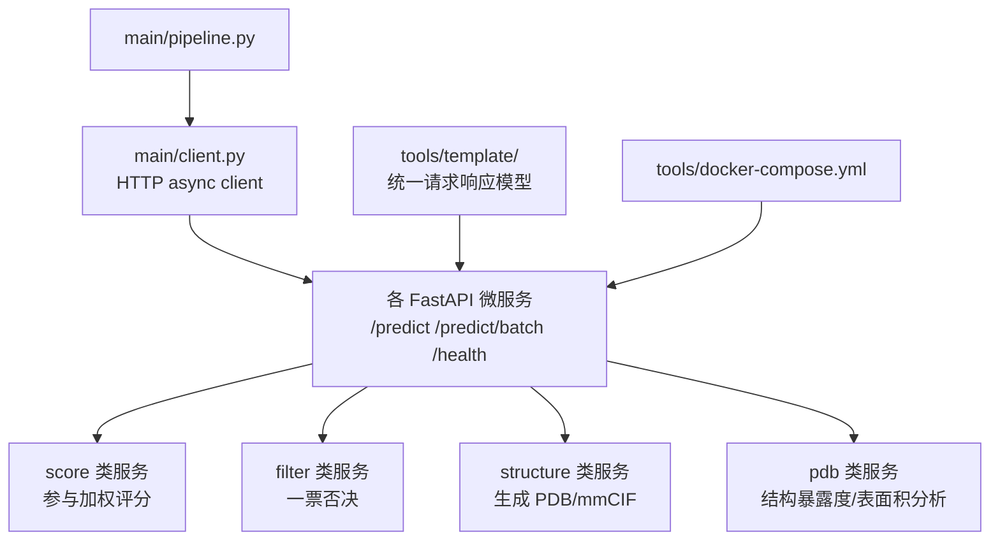

# iGEM-silk 项目结构图

## 仓库目录结构

```mermaid
flowchart TD
    root["iGEM-silk/"]

    root --> docs["docs/"]
    root --> data["data/"]
    root --> main["main/"]
    root --> tools["tools/"]
    root --> references["references/"]
    root --> output["output/"]
    root --> config_files["项目配置与方案文档"]

    config_files --> pyproject["pyproject.toml"]
    config_files --> uvlock["uv.lock"]
    config_files --> program["PROGRAM.md / PROGRAM 0.md"]
    config_files --> agents["AGENTS.md / CLAUDE.md"]

    data --> silk["silk.fasta\n丝素蛋白 scaffold"]
    data --> linker["linker.fasta\nlinker 序列库"]
    data --> function_csv["function.csv\n功能肽数据库"]

    main --> pipeline["pipeline.py\n7 步流水线编排"]
    main --> loader["data_loader.py\n读取 FASTA / CSV"]
    main --> enum["enumeration.py\n理化筛选 / 枚举 / 禁入区"]
    main --> client["client.py\n异步调用微服务"]
    main --> main_config["config.py\n端口 / 阈值 / 权重"]
    main --> entry["__main__.py / __init__.py\nCLI 入口"]

    tools --> compose["docker-compose.yml"]
    tools --> start_all["start_all.sh"]
    tools --> template["template/\n统一 FastAPI 模板"]
    tools --> fasta_services["FASTA 评分服务"]
    tools --> pdb_services["PDB 评分服务"]
    tools --> structure_services["结构预测服务"]

    fasta_services --> anox["AnOxPePred\n抗氧化"]
    fasta_services --> bepipred["BepiPred-3.0\nB 细胞表位 / 暴露代理"]
    fasta_services --> toxin["ToxinPred3\n毒性"]
    fasta_services --> hemo["HemoPI2\n溶血性"]
    fasta_services --> mhc["MHCflurry\nMHC-I 结合"]
    fasta_services --> cpp["pLM4CPPs / GraphCPP\n细胞穿透"]
    fasta_services --> tip["Tipred\n酪氨酸酶抑制"]
    fasta_services --> alg["algpred2\n过敏原"]

    pdb_services --> sasa["SASA\n溶剂可及表面积"]

    structure_services --> af3["AlphaFold3\n全长结构预测"]
    structure_services --> pepfold["PEP-FOLD4\n短肽结构预测"]

    references --> howto["工具使用笔记"]
    references --> result["result-kyxq0/\n示例结构预测结果"]

    output --> step_outputs["step01-step07 输出\nCSV / JSON / ranking"]
```

## 7 步管道结构

```mermaid
flowchart LR
    s1["Step 1\n加载 silk / linker / peptide 数据"]
    s2["Step 2\n功能肽理化预筛\n长度 / GRAVY / 电荷 / pI"]
    s3["Step 3\n调用微服务给功能肽评分"]
    s4["Step 4\n肽级硬过滤 + Top-N 选择"]
    s5["Step 5\n超级枚举 construct\n肽 × 插入位点 × linker"]
    s6["Step 6\nconstruct 禁入区预过滤\npoly-Ala / Cys / 疏水核心"]
    s7["Step 7\n综合评分排序\n输出 Top candidates"]

    s1 --> s2 --> s3 --> s4 --> s5 --> s6 --> s7

    services["tools/ 微服务集群"] --> s3
    config["main/config.py\n阈值 / 权重 / 端口"] --> s2
    config --> s3
    config --> s4
    config --> s6
    data["data/ 输入文件"] --> s1
    s7 --> output["output/ 结果文件"]
```

## 微服务接口结构

```mermaid
flowchart TD
    pipeline["main/pipeline.py"]
    client["main/client.py\nHTTP async client"]
    template["tools/template/\n统一请求响应模型"]
    compose["tools/docker-compose.yml"]

    pipeline --> client
    client --> services["各 FastAPI 微服务\n/predict /predict/batch /health"]
    template --> services
    compose --> services

    services --> score["score 类服务\n参与加权评分"]
    services --> filter["filter 类服务\n一票否决"]
    services --> structure["structure 类服务\n生成 PDB/mmCIF"]
    services --> pdb["pdb 类服务\n结构暴露度/表面积分析"]
```

